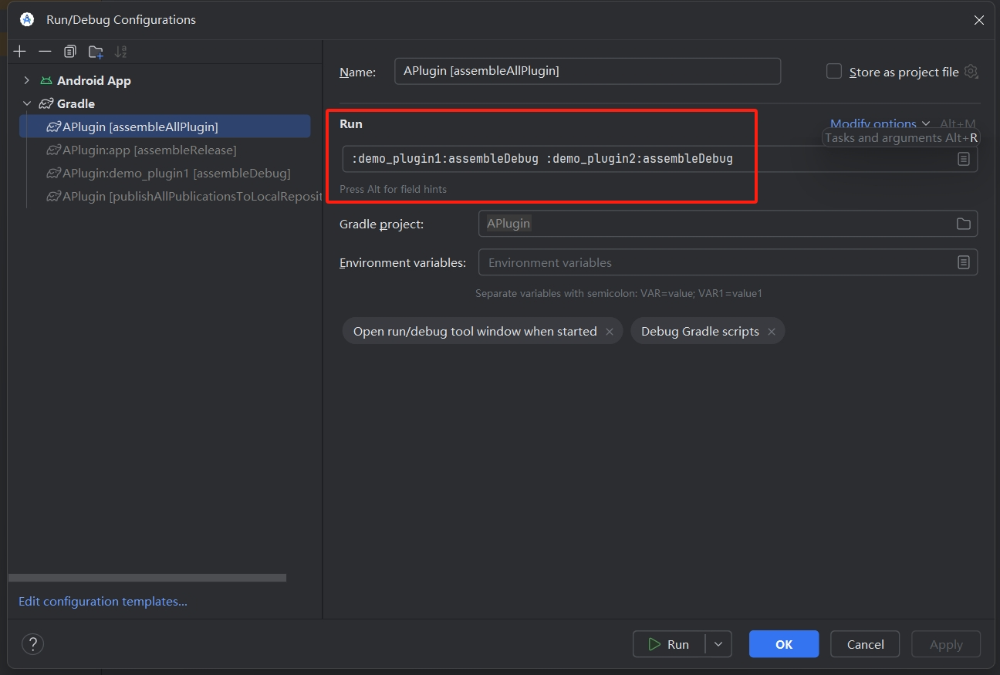
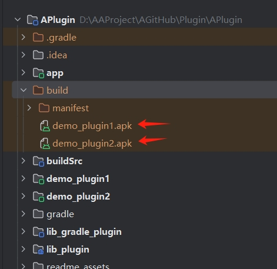
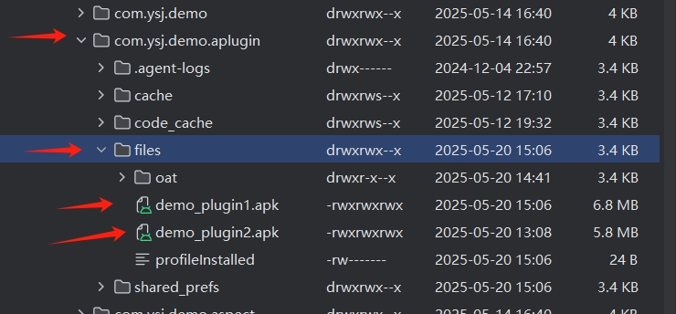

## 安卓稳定插件化 

本插件化方案旨在稳定与全面，在确保稳定的前提下尽可能多的支持原生的特性。理论上本库兼容插件中四大组件的所有特性。

目前本方案在大于等于 `android-api-29` 时不会产生 hook，而在小于此版本时官方不会限制对 hide-api 的反射，且本库在兼容低版本时仅使用了 3 处 hook。因此理论上高版本不会产生兼容性问题，而低版本的兼容性问题也在可控范围内。

本库提供了编译插件用于简化使用，插件会自动将所有插件的 `AndroidManifest` 中的权限与四大组件和主包的进行合并，因此不需要手动配置。在本库中除了 `ContentProvider` 外其它组件实际都会在编译时自动注册到主包中，因此这些组件不支持动态增加。虽然牺牲了一定的灵活性，但带来了理论上全兼容的组件特性。

### 了解与编译本工程

#### 结构

**StablePlugin**

- `app`  用于演示的主包
- `buildSrc` 用于管理 maven 发布与版本控制
- `reops` 本地 maven 仓库，用于开发时调试插件
- `demo_plugin1` 用于演示的插件1
  - `api` 插件1用于对外通信的接口（基于 **[component-di](https://github.com/Ysj001/bcu-modifier-component-di)** 实现）
- `demo_plugin2` 用于演示的插件2
- `lib_gradle_plugin` 本库的 gradle 插件源码
-  `lib_plugin` 本库的 android 库依赖源码

#### 编译

在打开本项目前先在项目根目录下执行如下命令生成 gradle 插件后 sync 项目

- `gradlew publishAllPublicationsToLocalRepository`

##### 测试 demo

测试

1. 使用如下命令先生成插件包
   - `gradlew :demo_plugin1:assembleDebug :demo_plugin2:assembleDebug`

​	或按下图所示配置插件包构建任务并运行

2. 在插件构建完成后你会在项目根目录的 build 文件夹内看到构建完成的插件和用于合并到主包的 manifest 目录

3. 将 app 编译并运行到手机上

   - 后续如果插件的四大组件在 manifest 的配置有变动请重复步骤 1  后重新编译 app

4. 将步骤 2 所示的插件导入如下所示目录中（默认目录： /data/data/com.ysj.demo.aplugin/files）

   

5. 在 demo app 中安装后即可启动插件的功能了

### 使用

**TODO**
